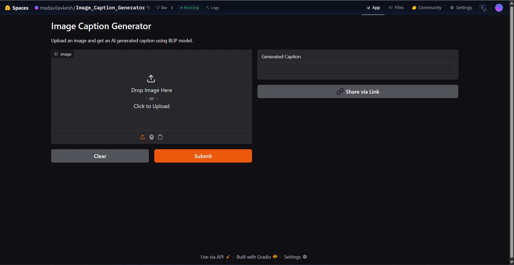
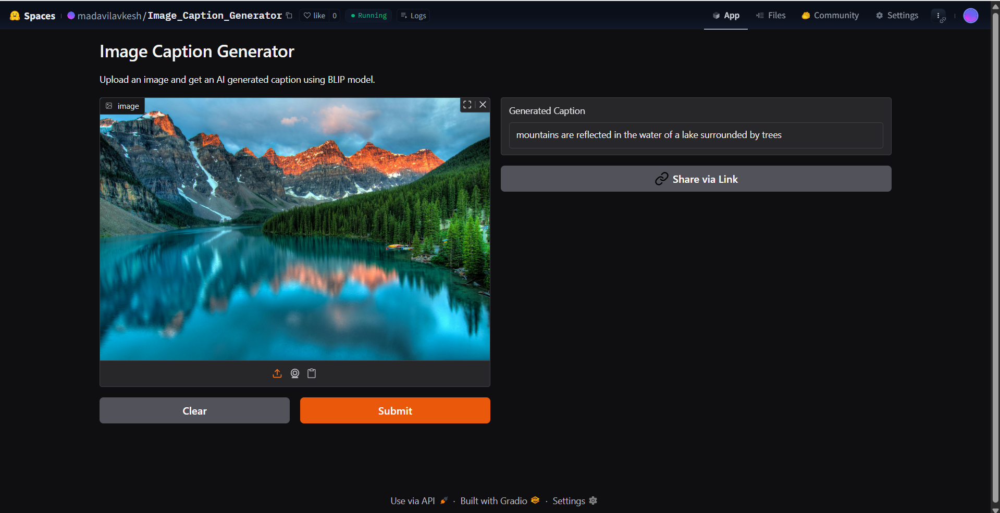
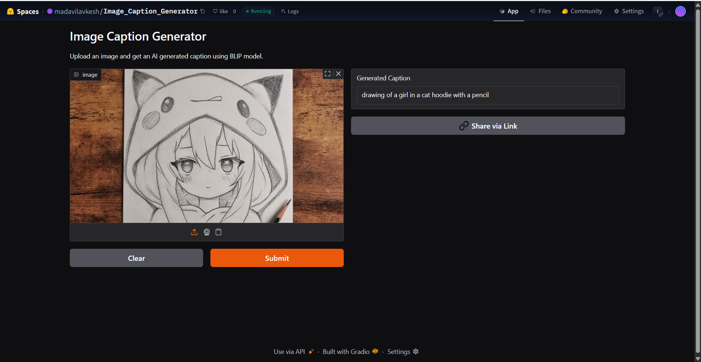

# Image-Caption-Generator

# 🖼️ Image Caption Generator

This web app generates human-like captions for images using the **BLIP** model by Salesforce. Upload an image and get an AI-generated caption instantly.

---

## 🚀 Live Demo

👉 [Try it on Hugging Face Spaces](https://huggingface.co/spaces/madavilavkesh/Image_Caption_Generator)

---

## 🖼️ Screenshots

### 🧑‍💻 Interface Preview



---

### 🖼️ Test Image 1

**Input:**


**Caption Output:**


---

### 🖼️ Test Image 2

**Input:**


**Caption Output:**


---

## 📋 Features

- Generates natural image captions using `Salesforce/blip-image-captioning-large`
- Easy-to-use Gradio interface
- Runs on Hugging Face Spaces

---

## 🛠️ Run Locally

```bash
git clone https://huggingface.co/spaces/your-username/your-space-name
cd your-space-name
pip install -r requirements.txt
python app.py
